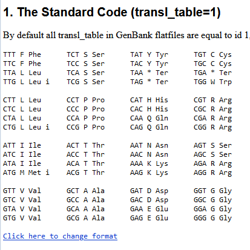

# why do we need to prepare our data?
let's say that we want to write a program that mimics what trna does in real life. 
we want our program to go through a dna sequence and read the sequence three letters by three letters, codon-based, and then translate each to its corresponding amino acid.

before even starting to write the program, we need to tell our programming language which codon corresponds to which amino acid.
for that we would go to [standard genetic code page](https://www.ncbi.nlm.nih.gov/Taxonomy/taxonomyhome.html/index.cgi?chapter=tgencodes#SG1) and see the codon-amino acid pars. 

**we _see_ this table but how can our programming language access it?**



data preparation here means that you make these types of information readable files for your programming language.
for example, this data in html on a website needs to be converted into a `.csv` (comma-separated) or `.xlsx` (excel) file to make it accessible and compatible for your program.

if you learn how to do this right, the rest of the programming would be easy, especially with all the ai help we have.

# how to prepare your data

i use VS Code as my code editor and i access wsl remotely inside it. 

so let's use the codon - amino acid pair for creating the table.

**1. copy data**

we copy from the website and paste it into a file with `.csv` extension in VS Code.
(you need to create a new file and call it something like `data_preparation.csv` to get a file in csv format.)


**2. clean the data**

we actually don't need all the information here. just the pairs would be enough for us.  
i would like to keep the single-letter amino acid codes and codons and clean everything else.

## before cleaning the data
Always Render Whitespace To See It Visually And Be Able To Count Its Number.

go to your VS Code settings, search for **rendering whitespace**, and set it to `all`. after activation, it should look like this:


now we can delete all the information that we don't want manually, or we can use a tool called **regular expression** or **regex** for short.

do whichever you feel most comfortable with for your first data preparations, but regex is super easy and fast, so i am using it here.

> also you don't need to memorize any regex patterns. you can always search & ask ai.

- press `ctrl + H` in vs code to access regex:


- then type this on the first line and the latter to the second:

```regex
(\w{3}) (\w) (\w{3})
```
```regex
$1,$2
```


- then replace them by pushing enter (or replace all).


- you can fix the rest manually.

also, pay attention to the tiniest details, like how many spaces are where. they could cause big trouble later. make it as clean and smooth as possible.


- now line them:

```regex
(\w{3}),(\w)
```
```regex
$1,$2\n
```


- use `^` followed by six spaces, and leave replace empty:

```regex
^
```
```regex

```


- fix the rest manually:


- delete the space between the lines (replace by nothing):

```regex
^\s*$\n
```
```regex

```


save your file (ctrl + S) and enjoy working with it.

and the answer to our introductory question will be discussed on the dictionaries page.


