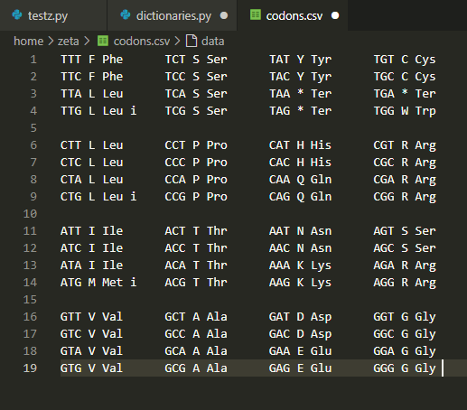

# why do we need to prepare our data?
let's say that we want to write a program that mimics what trna does in real life. 
we want our program to go through a dna sequence and read the sequence three letters by three letters, codon-based, and then translate each to its corresponding amino acid.

before even starting to write the program, we need to tell our programming language which codon corresponds to which amino acid.
for that we would go to [standard genetic code page](https://www.ncbi.nlm.nih.gov/Taxonomy/taxonomyhome.html/index.cgi?chapter=tgencodes#SG1) and see the codon-amino acid pars. 
**we _see_ this table but how can our programming language access it?**

data preparation here means that you make these types of information readable files for your programming language.
for example, this data in html on a website needs to be converted into a `.csv` (comma-separated) or `.xlsx` (excel) file to make it accessible and compatible for your program.

if you learn how to do this right, the rest of the programming would be easy, especially with all the ai help we have.

# how to prepare your data

i use VS Code as my code editor and i access wsl remotely inside it. 

so let's use the codon - amino acid pair for creating the table.

1. copy data from the website and paste into VS Code.

